<p align="center"></p>

# SlimefunWarfare for DrakesCraft

[](https://github.com/DrakesCraft-Labs/SlimefunWarfare-Drake/actions/workflows/build.yml)


A maintained, production-hardened port of SlimefunWarfare for the Drake Slimefun core. It adds
military technology, rare-earth processing, chemical weapons and modular powered armor without
allowing those systems to bypass DrakesCraft's modality or protection boundaries.

## Highlights

- Firearms, energy weapons, ammunition and chemical grenades.
- Modular powered armor with movement, survival and defensive modules.
- Rare-earth ores, advanced alloys, meteor technology and processing machines.
- Stable original item IDs and recipes for data compatibility.
- Native Drake-core API and Java 21 / Minecraft 1.21.11 support.
- Explicit world allowlist and Slimefun protection checks.
- Non-destructive explosions; nuclear activation disabled by default.
- No external auto-updater and no GuizhanLib runtime dependency.

The complete progression and system reference lives in [docs/CONTENT.md](docs/CONTENT.md).

## Build

```bash
mvn --batch-mode clean verify
```

The production artifact is generated at `target/SlimefunWarfare.jar`.

## Runtime requirements

- Paper or Purpur 1.21.11
- Java 21
- Slimefun4-Drake `11.0-Drake-1.21.11-SNAPSHOT`

Review `safety.allowed-worlds` before deployment. The default configuration permits only the
three primary Slimefun dimensions and keeps every other modality isolated.

## Credits

Original concept and implementation by Seggan and upstream contributors. Drake maintenance,
compatibility work, Spanish in-game presentation and production hardening by Jack / DrakesCraft Labs.

This repository retains the original license in [LICENSE.txt](LICENSE.txt).
